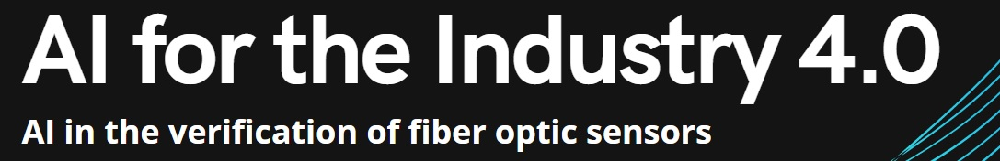

  

The project was created as a recruitment task. Includes a regression problem. 

XYZ company wants to introduce AI algorithms for fiber optic sensor verification.
### The aim of the project was to build a model for predicting spectroscopy measurements (amplitude).

### How to Run the Project?
To open the project, use the git clone command or download the selected files.

### What can be improved in the notebook? 
1. Using the os/glob/Path libraries to automate loading files.
2. Selection of hyperparameters for the Random Forest model.
3. Building a model of neural networks.

### The repository contains:
* projekt.py - Google Collab notebooks include data loading, exploration, data preprocessing, machine learning model building and results
* Preliminary results.pdf - pdf file include publication of your preliminary results 
* concept of project.pdf - pdf demonstrate my concept of this project in order to convince the client of my idea
* Recruitment Task - include recruitment task
* ai.jpg -image

